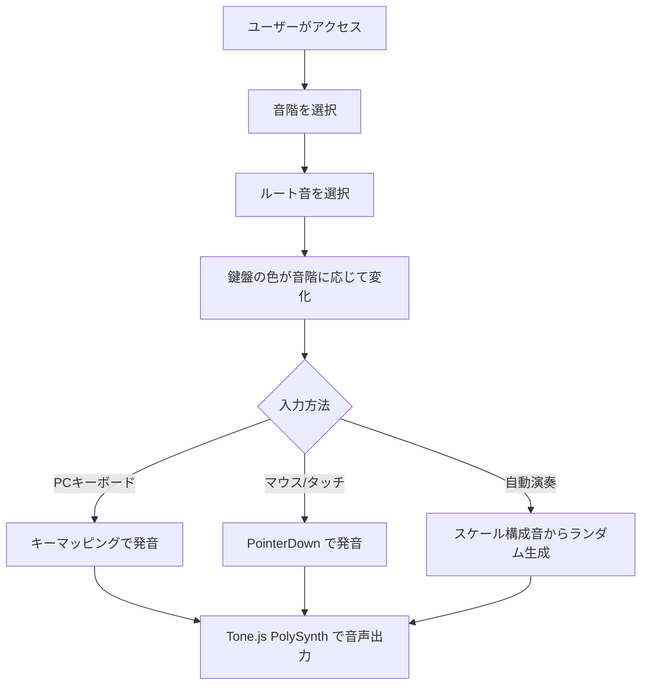

# Sound Study - 音階学習ピアノ

音階（スケール）を選ぶと該当する鍵盤の色が変わり、PCキーボード・マウス・タッチで演奏できるWebアプリ。音楽初心者が「音階とは何か」を体感するためのもの。

## アプリケーションフロー



## 技術スタック

- **フロントエンド**: React (Vite) + TypeScript + Tailwind CSS v4
- **音声**: Tone.js (PolySynth + triangle オシレーター)
- **インフラ**: AWS CDK (S3 + CloudFront + Route53 + ACM)
- **ドメイン**: https://sound-study.homisoftware.net

## 機能

- C3〜C5 の25鍵ピアノ鍵盤（日本語音名付き）
- 8種の音階（メジャー、マイナー、ペンタトニック、ブルース、ドリアン、フリジアン、リディアン、ハーモニックマイナー）
- 12キー（C〜B）のルート選択
- PCキーボード / マウス / タッチ操作
- 自動演奏（スケール構成音からランダムメロディ生成）
- メトロノーム（4拍子、BPM調整可能）

## ローカル環境構築手順

```bash
cd web
npm install
npm run dev
# http://localhost:5173 でアクセス
```

## 本番デプロイ手順

### 初回（インフラ構築）

```bash
# CDK デプロイ（S3 + CloudFront + Route53 + ACM を作成）
cd infra
npm install
npx cdk bootstrap --region us-east-1  # 初回のみ
npx cdk deploy
```

### 2回目以降（コンテンツ更新のみ）

```bash
# プロジェクトルートで実行
./deploy.sh
```

`deploy.sh` は以下を実行します：
1. `npm run build` でフロントエンドをビルド
2. `aws s3 sync` で S3 バケットを更新
3. `aws cloudfront create-invalidation` でキャッシュを削除
